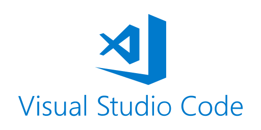
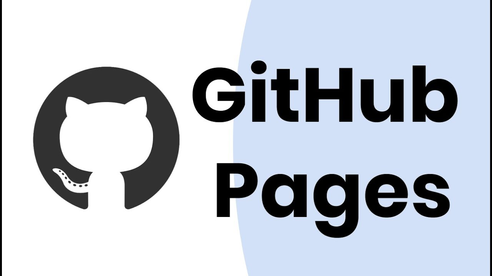

# Collaborative Coding with GitHub and Related Tools

## Collaborative Coding for Robot Game

While working on our robot game, we __started having many Python code files for the 14 missions and different strategies__. It became __difficult to keep track of the files__, especially among different team members.

To organize our code better and help all team members know what changes we have made or are making, we have used GitHub, Visual Studio Code and Sourcetree.

### GitHub

GitHub is really helpful for __keeping all of our Python code in one place__. We __can work on it together__, even when we don't sit together.

Anika is our original __GitHub administrator__, and she __created our GitHub organization [`Noddin-Robotmakers`](https://github.com/Noddin-RobotMakers)__ and invited the remaining team members to sign up for their accounts and join that organization as members.

You can see [__all of our Pybricks code shared openly on GitHub__](https://github.com/Noddin-RobotMakers/RobotMakers-FLLChallenge-Masterpiece), in a repository under that organization.

We have used an advanced feature called "__Pull Requests__" to help us __review complicated changes__ and make sure no mistakes are made.

### Visual Studio (VS) Code

Visual Studio Code has __automated code checkers__ that help us __code faster__ and with much __fewer mistakes__.

### Sourcetree

Sourcetree __makes it a lot simpler for us to work with Git, which is a useful but difficult tool__ for tracking code. Sourcetree __shows visually the changes__ we have made or are making to our code.

## Collaborative Coding for Team Website

After we nearly finished our robot game coding, we decided to work on something new: a __website (this very one!) to share all of our learning experiences and memories__! We have chosen to use GitHub Pages because it is easy to use and we already know how to work with GitHub.

While working with GitHub Pages, we have learned related tools for website building:

- We use __Markdown__ to write __content for our pages__;
- __Jekyll__ then turns the Markdown files to the web pages;
- __HTML__ helps us adjust the layout;
- __CSS__ helps us change the look and feel to make them visually nice.

We have also figured out how to add __pictures and videos__ to our pages to make them look cool. Overall, we have had a great time working together on our website, and picking up these new tools!

[__All of our website code__](https://github.com/Noddin-RobotMakers/Website) is also openly shared.
