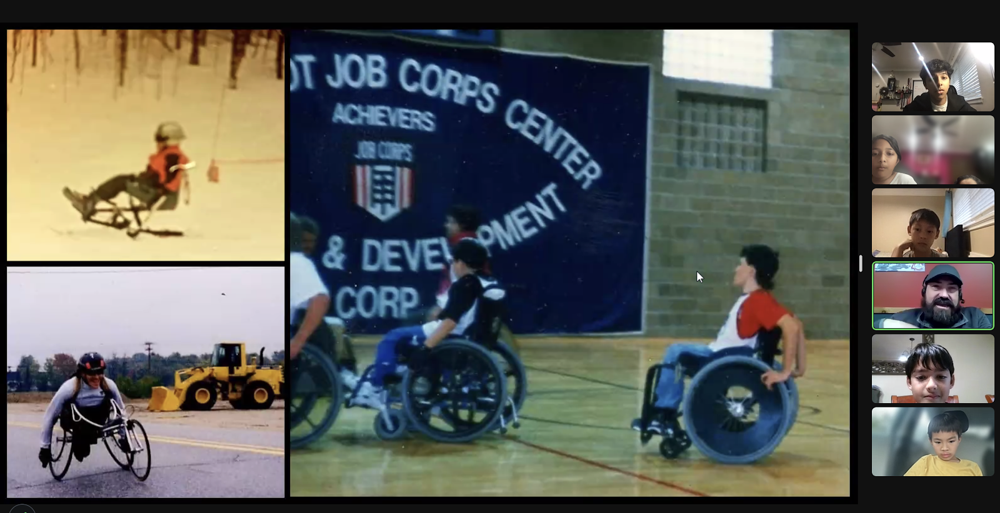
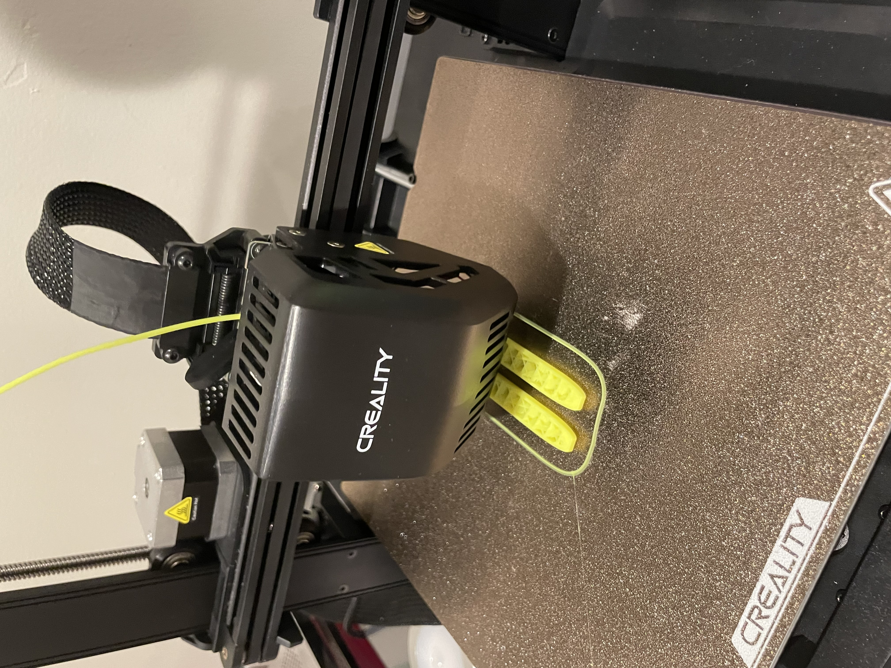
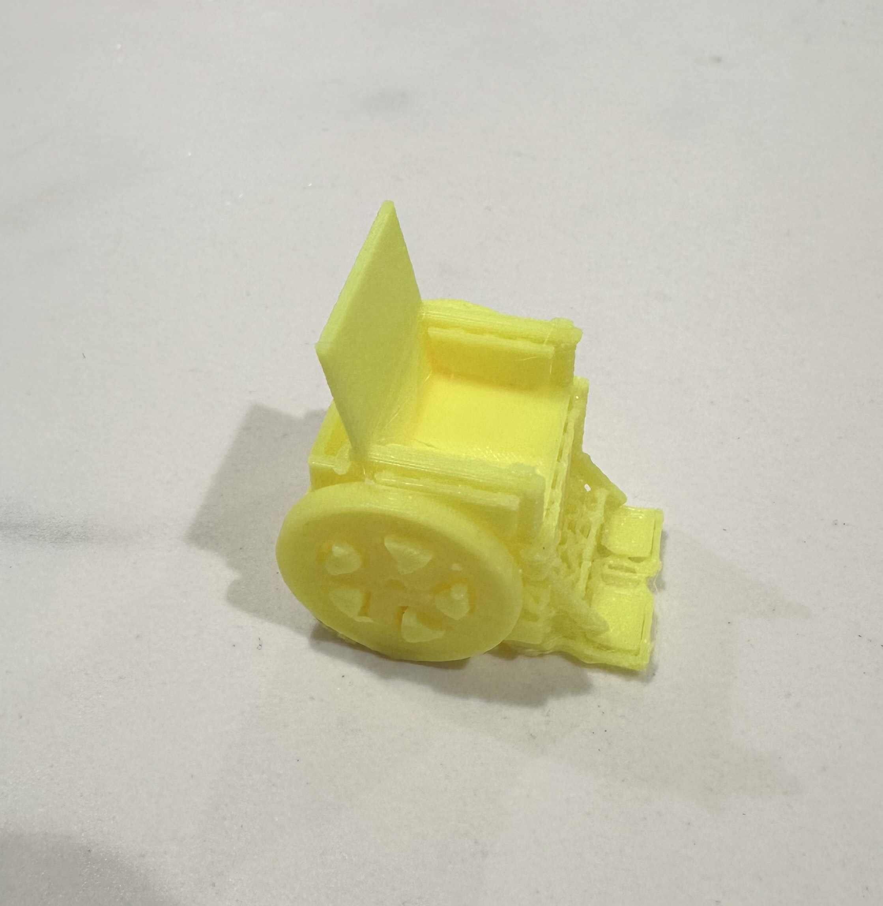

# Innovation Project

Innovation is one of the six _FIRST_ Core Values, and we have got an awesome opportunity to research about and design solutions for this season's Innovation Project. This project challenges us to use technology to enable more people to enjoy rewarding hobbies. We have decided to focus on __helping disabled people ski__ with efficiency and safety.

## Outreach to Disabled Sports Innovators

We wanted to learn from the best, so we have reached out to and e-mailed 6 different disabled sports organizations across the US, which are:

- [Adaptive Sports Center, Colorado](https://www.adaptivesports.org)
- [Adaptive Sports Connection, Ohio](https://adaptivesportsconnection.org)
- [American Blind Skiing Foundation (ABSF)](https://www.absf.org)
- [Blue Ridge Adaptive Snow Sports (BRASS)](https://www.brasski.org)
- [Maine Adaptive Sports & Recreation (MASR)](https://maineadaptive.org)
- [National Sports Center for the Disabled (NSCD)](https://nscd.org)

Among these organizations, __Maine Adaptive__ has responded to us and shared a lot of experience and insight with us. We have had an interview with [__Mr. Enock Glidden, one of Maine Adaptive's directors__](https://maineadaptive.org/staff), and talked about their design process, their products and our team's prototype. We have used Mr. Glidden's advice to improve our prototype solution.

## Learnings from Maine Adaptive

### Inspiration, Origin and History

[Maine Adaptive](https://maineadaptive.org) started in 1982. Some founders were disabled and wanted to experience sports like able-bodied people. Maine Adaptive has collaborated with innovative designers and toolmakers to create assistive equipment for people who have lost limbs, hearing or vision. To this date they have helped over 400 such people.

### Design Process

Maine Adaptive has developed a very comprehensive process for designing equipment to help disabled people. They have come up with personalized approaches for different disabilities, for example:

- __Bi-skis__ for people with weak upper bodies;
- __Four-tracker skis__ for people with balancing difficulties;
- __Sit-down skis__ for people who can't stand (people that have lost legs or are lower-body paralyzed);
- __Audio assistance__ for people with poor eyesight: for example, a bell can be used as a signal to turn, or a headset can connect visually-disabled skier with a guide who can tell when to turn or when to slow down to avoid obstacles; and
- __Special tethers__ on the sides of the slopes to prevent disabled/blind skiers from going off course.

We have learned a lot from their design process. It was very inspiring to learn how they customize their designs to give the users an experience that is very enjoyable and exciting.

### Materials, Production and Technology

#### Materials and Production

- We learned that Main Adaptive makes everything according to their __customers' individual needs__.
- Main Adaptive has everything measured and weight-checked.
- Main Adaptive's products use __aluminum__ and __titanium__ because they are __strong__ and do not break easily. Another advantage is that they are __super light__. These two materials are key for making sure the whole product doesn't break apart, and they are very useful at attachment points.
- However, the designs __sometimes take several years to complete and perfect__.

#### Technology

- Main Adaptive doesn't use much in the way of electronics, except for some gear and headwear.
- Most equipment is powered mostly manually with the help of gears and levers.
- Still, over the years, there have been major improvements in technology. In one case, the user would blow into a straw and that would start up the equipment. Such a trigger mechanism is very useful for disabled people with limited movement.

## Our Innovation: The *SkiChair 2.0*

Our team is developing a wheelchair that has skis attached to its wheels, and we call it the _SkiChair_ 2.0, with 2.0 standing for our 2nd design generation.

The _SkiChair_ 2.0 offers the following benefits:

- __Comfortable and Convenient__: The _SkiChair_ 2.0 helps people with disabilities have a comfortable skiing experience, and is convenient to get into and out of.
- __Fitting and Inclusive__: The _SkiChair_ 2.0 is made to fit diverse people with special needs.
- __Easy and Safe__: The _SkiChair_ 2.0 enables people to move through snowy or icy terrain in an easier way, without slipping.

### Design Modifications

Through 2 design iterations we have made several modifications to our design:

- Main Adaptive gave us feedback that the wheelchair would accelerate quite fast, so we have added brakes on each side of the wheelchair that can be used to steer and stop.
- We also discovered that we could use the brakes to push the chair forward, which could enable more consistent and controlled speed.

### Prototyping and Testing

With great help from Anika and Ryan's elder brothers, we have used a Creality 3D printer to print our model for further testing.

