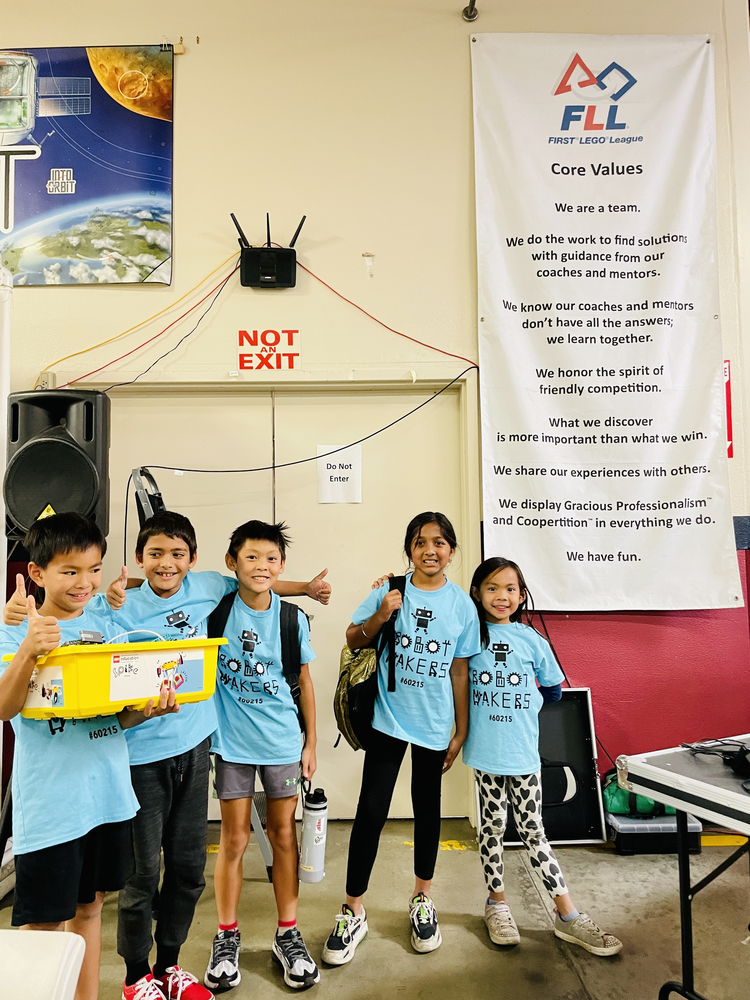

<!-- markdownlint-disable MD026 MD033 -->

# Hello from Noddin Robotmakers!

Hi there! We're a team of five students from Noddin Elementary School (San Jose, California) called the Robotmakers, participating in the 2023-2024 FIRST LEGO League (FLL) robotics competition. Our team consists of Anika, Aidan, Ryan, Antoni and Ariana. As of March 2024, we are in the San Francisco Bay Area Regional Championship after finishing well in the [Qualifier](https://youtu.be/gz8UgMTxCSI) in December.

Within this site, you'll find pages that talk about [who we are and how we've got together](Who-We-Are-and-How-We-Got-Together), [our robot game strategies and design process](Robot-Game-Strategy-and-Design-Process), [our programming methods](Python-Programming-with-Pybricks), [our Innovation Project](Innovation-Project), [the many tech tools we have learned](Tools-We-Have-Learned), a [gallery](Gallery) with our pictures, and much more about our learning journey and memories together!

Below are a few interesting highlights.

## Coding Our Robot with Pybricks

We use [__Pybricks__](Python-Programming-with-Pybricks), the __best open-source Python library for LEGO robotics__. Pybricks is useful because it is precise and because Python, which Pybricks is based on, is easy to read for all team members. Pybricks also supports us with a few advanced functionalities for running multiple programs and using special drivebase control.

## Innovation Project on Skiing for Disabled People

For our [Innovation Project](Innovation-Project), we focus on researching skiing because our team loves it and would like to __help disabled people enjoy skiing__ too. We've come up with a design named _SkiChair_ 2.0 that lets you sit down and still ski. We started by researching how we could assist individuals with disabilities in skiing, then reached out to organizations and experts for insights and feedback. After expert advice from [Maine Adaptive Sports & Recreation](https://maineadaptive.org), we have improved our design and 3D-printed our prototype.

## Collaboration and Website Building on GitHub

We have created and been managing our own [__GitHub__](Collaborative-Coding-and-Website-Building-with-GitHub) __organization__. We use GitHub to help us collaborate when we are not sitting together. Through GitHub, we can store and track our Python code, review each other's code changes to avoid mistakes, and make many improvements over time.

We have also __used GitHub Pages to make the website you are on right now__! We hope you enjoy your time here and explore our other pages listed on the sidebar.
