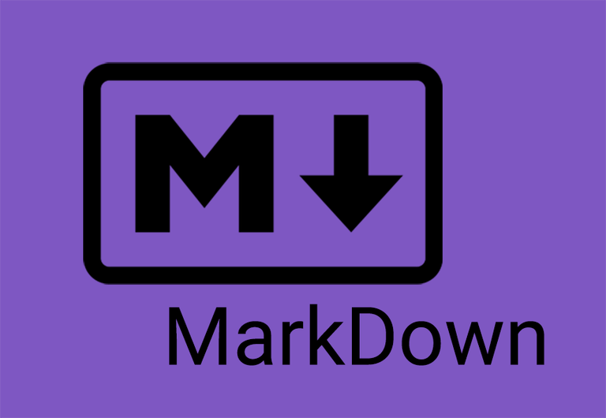
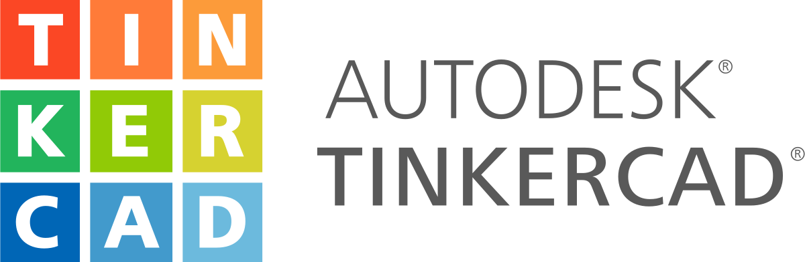

<!-- markdownlint-disable MD033 -->

# Tools We Have Learned

## Coding Tools

  

    

      
    

    

      We use Github to store our code and help us collaborate in coding .
    

  

  

    

      
    

    

      We use Visual Studio Code to orginize our code and keep it clean with automated code checkers
    

  

    

      
    

    

     We use Sourcetree to make it easy to commit code from our laptop to Github.
    

  

## Website Development Tools

  

    

      
    

    

      We use Markdown to write the content of our web pages.
    

  

  

    

      
    

    

    We use HTML to control the layout of our web pages.
    

  

    

      
    

    

     We use CSS to make the look and feel and text characters look nice.
    

  

    

      
    

    

     We use Github pages to turn our code into this beatiful website.
    

  

## Design Tools

  

    

      
    

    

      We use Figma to design our poster and team shirt.
    

  

  

    

      
    

    

      We use TinkerCAD to design the 3D modle.
    

  

## Google Collaboration Tools

  

    

      
    

    

      We use Google Docs to take meeting notes and to share ideas.
    

  

  

    

      
    

    

      We use google chat to communicate in a group.
    

  

  

    

      
    

    

      We use Google Drive to share and store our work.
    

  

  

    

      
    

    

      We use Google sheets for brainstorming and project management.
    

  

  

    

      
    

    

      We use Google Slides to design our poster.
    

  

