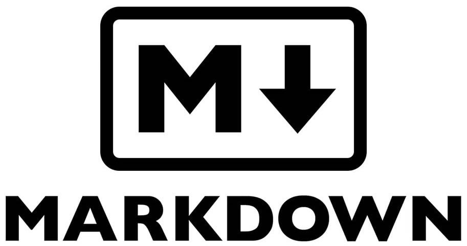
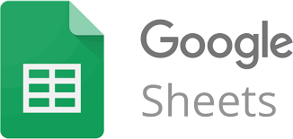

<!-- markdownlint-disable MD033 -->

# Tools We Have Learned

## General Coding Tools

  

    

      
    

    

      We use GitHub to store our code and help us collaborate in coding.
    

  

  

    

      
    

    

      We use Visual Studio Code to organize our code and keep it clean with automated code checkers.
    

  

  

    

      
    

    

      We use Sourcetree to make it easy to commit code from our laptops to GitHub.
    

  

## Robot Coding Tools

  

    

      
    

    

      We use Pybricks, the best open-source Python library for LEGO robotics, to control our robot.
    

  

## Website Coding Tools

  

    

      
    

    

      We use Markdown to write the content of our web pages.
    

  

  

    

      
    

    

      We use HTML to control the layout of our web pages.
    

  

  

    

      
    

    

      We use CSS to make the look and feel and text characters visually nice.
    

  

  

    

      
    

    

      We use GitHub Pages to turn our code into this beatiful website.
    

  

## Design Tools

  

    

      
    

    

      We use Figma to design our posters and team shirts.
    

  

  

    

      
    

    

      We use TinkerCAD to design our SkiChair 3D model.
    

  

## Google Collaboration Tools

  

    

      
    

    

      We use Google Chat to communicate in our team and with coaches and parents.
    

  

  

    

      
    

    

      We use Google Meet to have video calls with each other.
    

  

  

    

      
    

    

      We use Google Drive to store and share our files.
    

  

  

    

      
    

    

      We use Google Docs to take meeting notes and to share ideas.
    

  

  

    

      
    

    

      We use Google Sheets for brainstorming and project management.
    

  

  

    

      
    

    

      We use Google Slides to create our poster slides.
    

  

