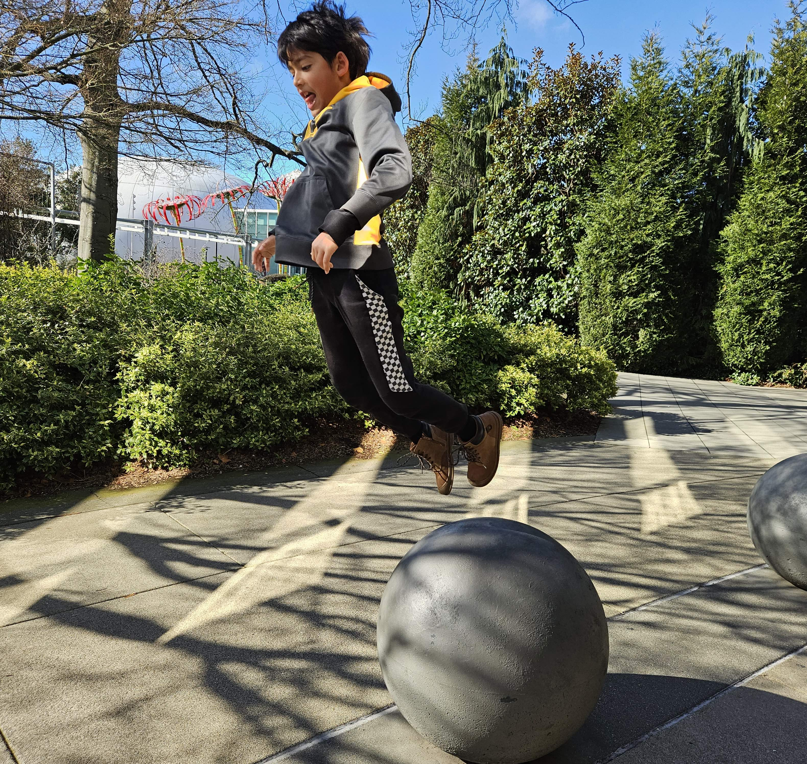
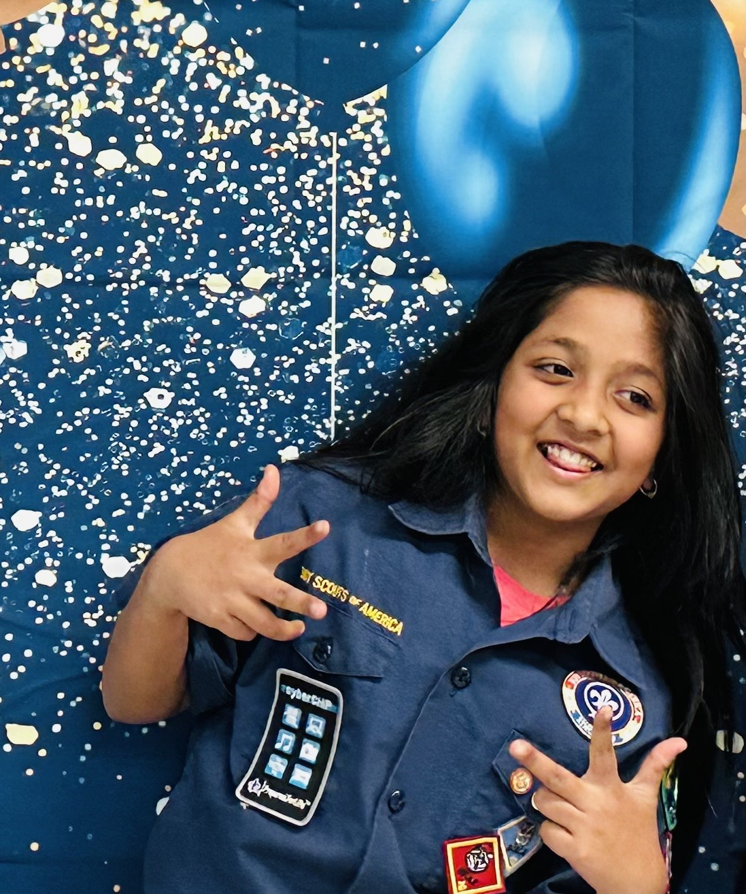
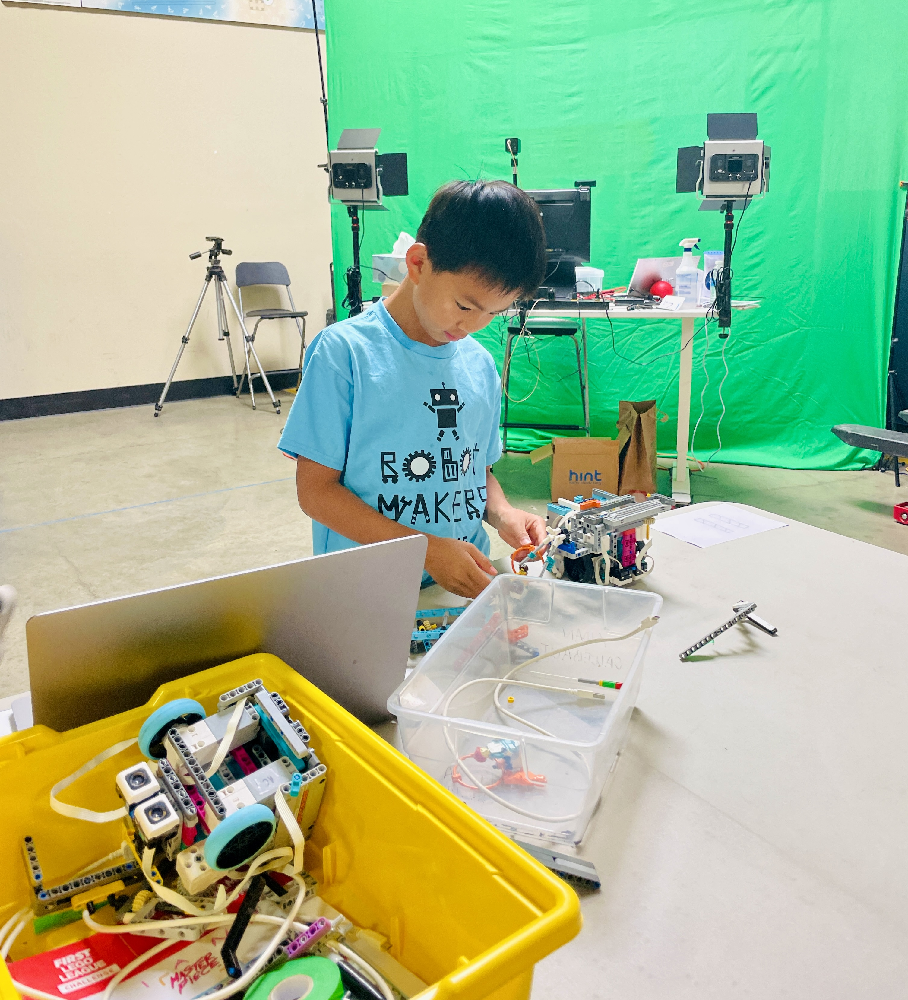
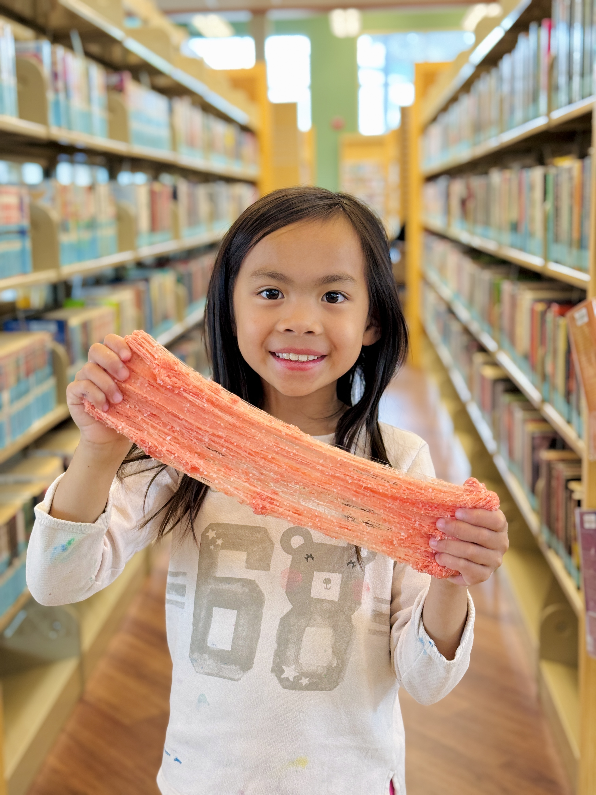
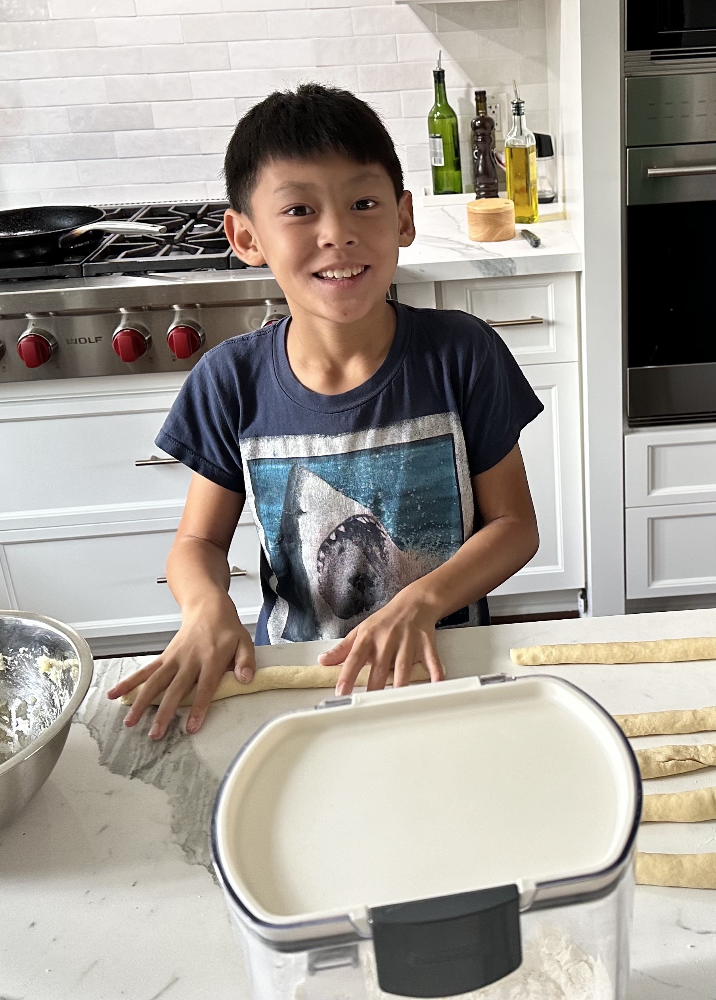

<!-- markdownlint-disable MD033 -->

# Who We Are and How We Got Together

## Fun Facts about Each of Us

  

    

      
    

    

      <h3>Aidan Callebaut</h3>
      Aidan favors the colors blue and green. He enjoys robotics, video games, and sports. He has been playing the piano since he was 5 years old. He loves math, reading, and running. His favorite food is sushi.
    

  

  

    

      
    

    

      <h3>Anika Gupta</h3>
      Anika's favorite colors are black and white. She loves painting, dancing, volleyball and hanging out with her brother.
    

  

  

    

      
    

    

      <h3>Antoni Luong-Pham</h3>
      Antoni has a fondness for the colors blue, black, and green. In his free time, he likes to play and tinker with LEGO. During the pandemic, he started exploring Robotics and was soon introduced to FLL. Antoni enjoys experimenting with various robotic systems, such as EV3, SPIKE Prime, Robot Inventor, and VEX IQ & VEX V5.
    

  

  

    

      
    

    

      <h3>Ariana Luong-Pham</h3>
      Ariana's favorite color is saffire blue. She loves playing with Chemistry, especially making slime of all kinds: butter slime, clear slime, fluffy slime, cloud slime, water slime, toothpaste slime, ziplock slime, icee slime and water-bottle slime!!
    

  

  

    

      
    

    

      <h3>Ryan Lee</h3>
      Ryan's favorite color is turquoise. His favrite hobbies are pickleball, baking/cooking, playing chess and video games.
    

  

## Good Friends at Noddin

We have known each other for several years at Noddin Elementary School in San Jose, California:

- __Aidan__ and __Ryan__ have been in the same class since 1st grade (2020-2021),
- __Anika__ has known Aidan and Ryan since 2nd grade (2021-2022),
- __Antoni__ has known the three of us since 3rd grade (2022-2023), and
- __Ariana__, who is Antoni's younger sister, has known us since 2023 when she entered 1st grade.

## Passion for Robotics

We all liked and wondered about Robotics so we got together to form this team.

- Anika has got inspiration and coaching from her brother, and got inspised to do FLL
- Aidan has loved coding and building, ever since he got a robotics set.
- Antoni and Ariana have been doing FLL Explore for 2 years already.

Our skills contribute to the team so we will continue reaching higher goals and challenges.
